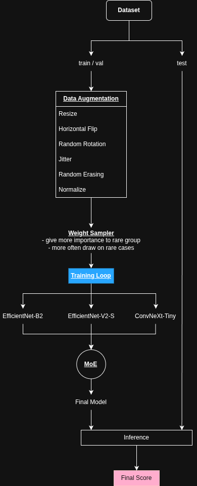

# Face Occlusion Prediction

> A PyTorch-based project for predicting facial occlusion levels from images.


# Project Structure

```bash
project/
├── crops/                        # Dataset csv
└── DataChallenge2026/
    ├── occlusion_datasets/       # Dataset
    ├── src/
    │   ├── dataset.py            # Data loading and preprocessing
    │   ├── train.py              # Training loop and optimization
    │   ├── inference.py          # Validation and test inference
    │   └── model.py              # Model architecture
    ├── config.py                 
    ├── metrics.py                # Challenge metrics
    └── main.py        
```


```bash
python main.py
```

# 1 - Pipeline




# 2 - Dataset

| Dataset        | Source                                 | Size    | Labels                                |
| -------------- | -------------------------------------- | ------- | ------------------------------------- |
| **Train**      | `occlusion_datasets/train.csv`         | 80,000+ | `filename`, `FaceOcclusion`, `gender` |
| **Validation** | Split from training set                | 20,000  | Same as train                         |
| **Test**       | `occlusion_datasets/test_students.csv` | Unknown | `filename` only                       |
| **Images**     | `../crops/Crop_224_5fp_100K/`          | 224×224 | `.jpg` / `.png`                       |

## Label Description

* `FaceOcclusion`:

  * between `0` and `1`
  * `0` = no occlusion
  * `1` = fully occluded face

* `gender`:

  * `0` = female
  * `1` = male


# 3 - Methodology

## Model(s)

* convnext_tiny
* efficientnet_b2
* efficientnet_v2_s


## Data Augmentation

Training images are augmented using:

* Random horizontal flip
* Random rotation
* Color jitter
* Random erasing
* Image normalization


## Balanced Sampling

To reduce dataset imbalance:

* Occlusion scores are grouped into bins
* Gender and occlusion bins are combined into groups
* A `WeightSampler` is used to balance training batches

This ensures fairer learning across : Different occlusion levels ; Male and female samples


## Training

The training pipeline includes:

* Gradient clipping
* Loss : SmoothL1Loss (improved)
* Optimizer : AdamW
* Learning-rate scheduling : CosineAnnealingLR
* Early stopping (based on MAE score)
* Validation
* Checkpoint saving

## Ensemble Inference

Inference supports model ensembling:

* Multiple trained models
* Associate weight for predictions
* Final predictions are clamped between `0` and `1`


# 5 - Evaluation

The weighted error is defined as:

$$
Err = \frac{\sum_i w_i (p_i - GT_i)^2}{\sum_i w_i}
$$

with:

$$
w_i = \frac{1}{30} + GT_i
$$

$$
Score = \frac{Err_F + Err_M}{2} + \left| Err_F - Err_M \right|
$$

# 6 - Outputs

| File                   | Description                                       |
| ---------------------- | ------------------------------------------------- |
| `best_model.pth`       | Best saved model checkpoint                       |
| `test_predictions.csv` | Predicted `FaceOcclusion` values for the test set |


